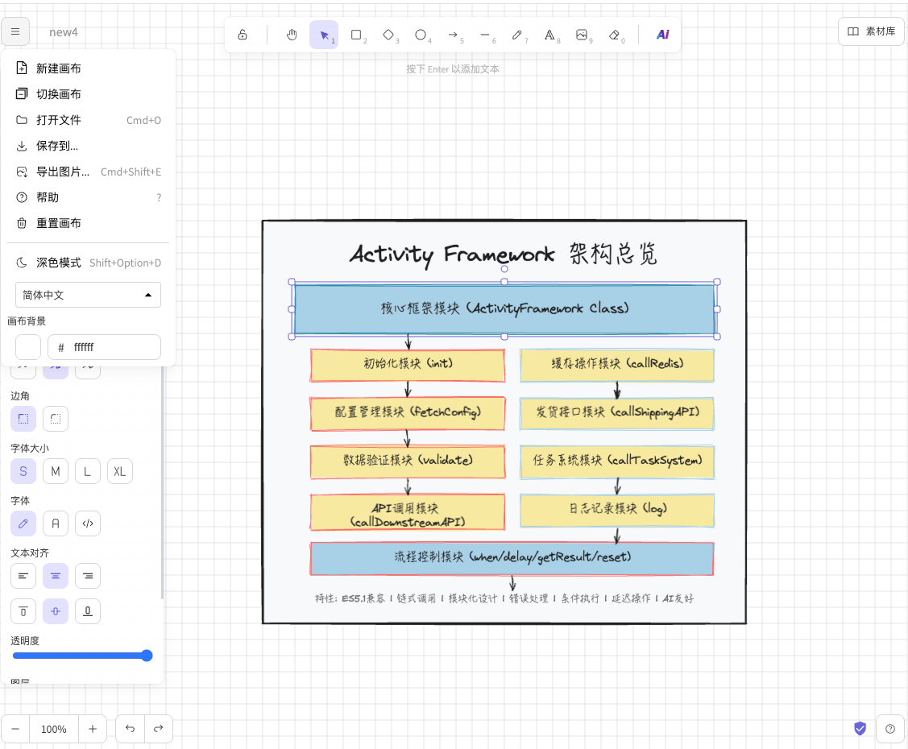
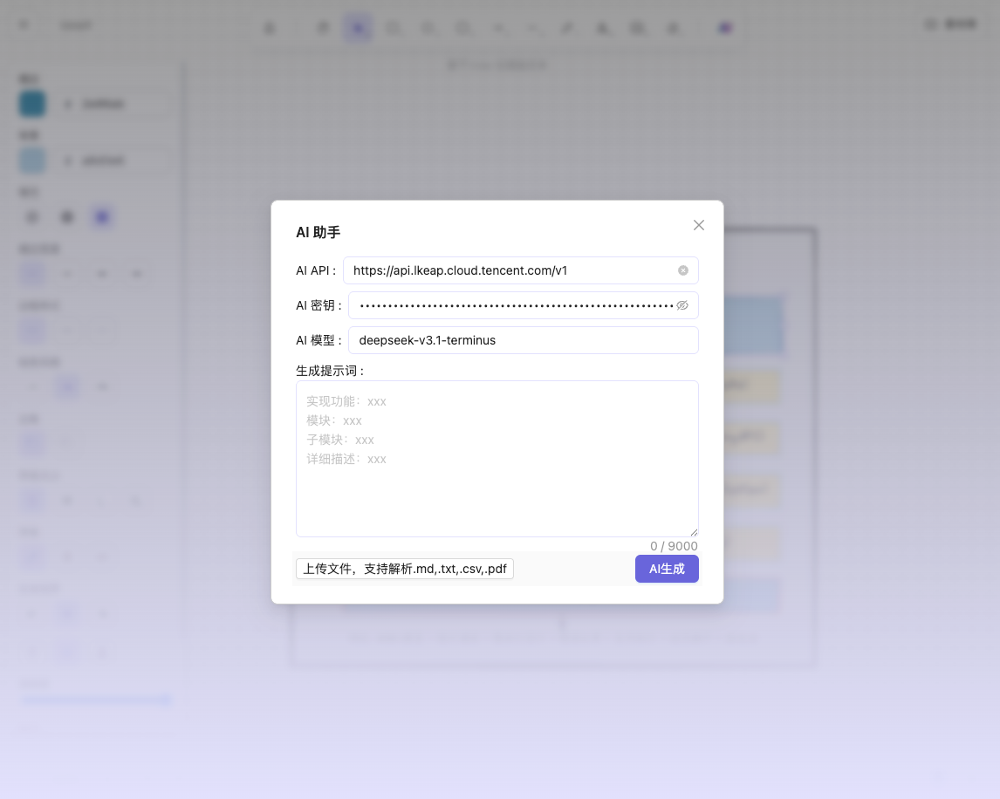

  


## Features

- [x] Chinese handwriting
- [x] Multi-canvas support
- [x] Field adapter scripts for multi-templates
- [x] More color choices
- [ ] Additional border styles
- [ ] Font selection
- [x] Mobile experience optimization (details TBD)
- [x] AI-generated content
- [ ] Fix PDF parsing issue

## Screenshots

 

## Live Demo

https://excalidraw-phi-woad.vercel.app/

## Local Installation

These instructions will get you a copy of the project up and running on your local machine for development and testing.

### Requirements

- [Node.js](https://nodejs.org/en/)
- [Yarn](https://yarnpkg.com/getting-started/install) (v1 or v2.4.2+)
- [Git](https://git-scm.com/downloads)

### Clone the repo

```bash
git clone https://github.com/linkxzhou/excalidraw-plus.git
```

### Install dependencies

```bash
yarn
```

### Start the server

```bash
yarn start
```

Now you can open [http://localhost:3000](http://localhost:3000) and start coding in your favorite editor.

### Collaboration

For collaboration, set up the local collab server: https://github.com/excalidraw/excalidraw-room

### Commands

#### Install dependencies

```
yarn
```

#### Run the project

```
yarn start
```

#### Reformat all files with Prettier

```
yarn fix
```

#### Run tests

```
yarn test
```

#### Update test snapshots

```
yarn test:update
```

#### Test for formatting with Prettier

```
yarn test:code
```

### Docker Compose

You can use docker-compose to work on Excalidraw locally if you don't want to set up a Node.js environment.

```sh
docker-compose up --build -d
```

## Project Sources

(1) https://github.com/korbinzhao/excalidraw-cn  
(2) https://github.com/excalidraw/excalidraw
